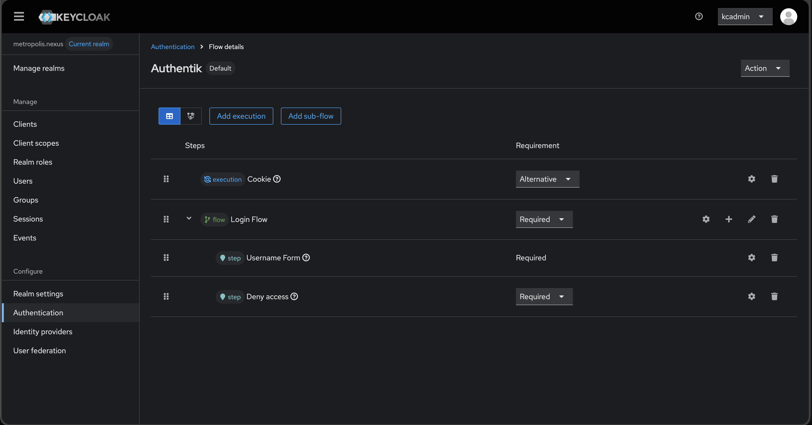
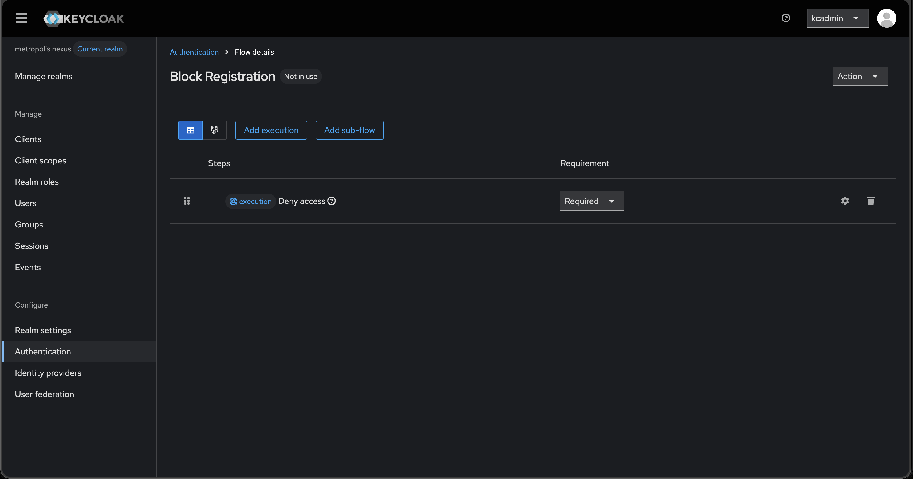

# System Setup

- Create `/etc/ssh/sshd_config.d/10-certs.conf`:

```
PermitRootLogin prohibit-password
```
- Restart sshd
- Add NGINX's ssh key to `/root/.ssh/authorized_keys`
- rsync TLS certificates to `/srv/authentik/authentik/certs/auth.metropolis.nexus`

# Create the Permanent Admin User

- Create the `kcadmin` user
  - Password -> Set `kcadmin`'s password
  - Role mapping -> Assign role
    - Realm roles -> `role_admin`
- Log out and log into `kcadmin`
- Delete the `admin` user

# Master Realm

## Realm Settings

### General
- User-managed access -> On

### Login
- Login with email -> Off

# Metropolis.nexus Realm
- Manage realm -> Create realm -> `metropolis.nexus`

## Realm Settings

### General
- User-managed access -> On

### Login
- Login with email -> On

### User profile
- email -> Required -> On
- firstName -> Required -> Off
- lastName -> Required -> Off

## Authentication
- Create Authentik flow (Note that we are not using the Identity Provider Redirector here because the implementation is broken and will make it impossible to log out)

- Bind Authentik flow as the browser flow
- Create the Block Registration flow (otherwise registration can still be triggered under certain condition)

- Bind Block Registration as the registration flow

## Identity Providers
Add Keycloak Open ID connect

- Alias -> Authentik
- Discovery endpoint -> https://auth.metropolis.nexus/application/o/keycloak/.well-known/openid-configuration
- Client assertion signature algorithm -> ES256
- Hit "Add"
- PKCE -> On
- PKCE Method -> S256
- Backchannel logout -> On
- Scope -> openid profile email
- Prompt -> Consent
- Access Token is JWT -> On
- Trust Email -> On
- Show in Account console -> Never
- Sync mode -> Force
- Case-sensitive username -> On
- Hit "Save" again